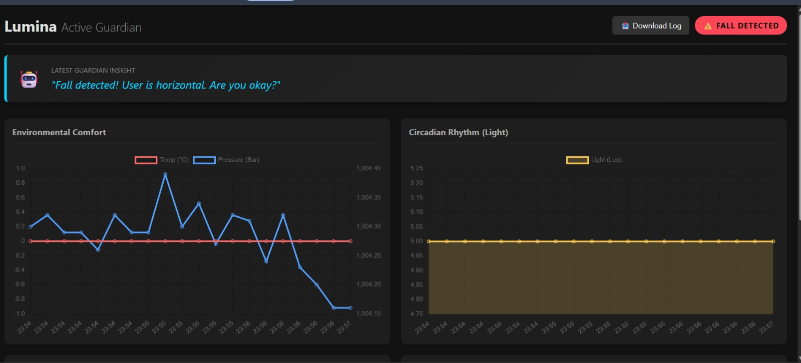

# Lumina: Active Guardian Smart Home Sensor

> *"Lumina doesn't just measure the room; it understands how the environment affects the human inside it."*

---

## 📖 Overview

Current smart home devices are "passive"—they show you numbers but don't explain what they mean. **Lumina** is an Active Guardian. It combines a **Wearable Node** (Activity Tracking) with a **Stationary Hub** (Environmental Sensing) to monitor both the user and their surroundings.

Lumina operates on a **Hybrid Edge-Cloud Architecture**. It uses a local server to aggregate and visualize sensor data in real-time. For complex analysis, it employs a gateway that sends raw telemetry to the **Nvidia Nemotron LLM** (via OpenRouter). This allows the system to offer advanced, context-aware intelligence directly to the user based on environmental and physical states.

### Key Features
* **AI-Driven Context:** Converts raw sensor data (e.g., `"1003 mbar"`, `"6 Lux"`) into human-readable advice (e.g., *"Storm approaching, secure the windows"*).
* **Fall & Activity Detection:** Uses accelerometer data to detect falls or sleep restlessness based on impact and body orientation.
* **Holistic Monitoring:** Simultaneously tracks Light, Pressure, Temperature, and Motion to build a complete picture of the user's environment.

---

## 🖼️ Demo / Examples

<table>
  <tr>
    <td align="center" width="50%">
      
      <br />
      <sub><b>Figure 1:</b> The Lumina Device and Dashboard Setup</sub>
    </td>
    <td align="center" width="50%">
      
      <br />
      <sub><b>Figure 2:</b> Real-time Data Visualization and Hybrid AI Chat Interface</sub>
    </td>
  </tr>
</table>

---

## ✨ Features (Detailed)

### 1. Environmental Telemetry
The stationary hub continuously monitors the "health" of the room:
* **Barometric Pressure:** Predicts incoming storms and weather changes (e.g., sudden drops < 1000 mbar).
* **Ambient Light:** Detects if the lighting is sufficient for the user's current activity (Reading vs. Sleeping) based on the time of day.
* **Temperature:** Monitors for heat stress risks using accurate environmental sensors.

### 2. Activity & Safety Monitoring
The accelerometer module (simulating a wearable tag) tracks the user's physical state:
* **Fall Detection:** Identifies sudden high-G impacts followed by a change in tilt orientation (user becoming horizontal).
* **Sleep/Rest Analysis:** Tracks micro-movements to determine if a user is restless or sleeping soundly.

### 3. AI Analysis
* **Cloud Intelligence:** Complex queries combining time, sensor states, and historical context (e.g., *"Is this combination of pressure drop and restlessness dangerous?"*) are routed to the Nvidia Nemotron LLM.
* **Contextual Memory:** The system retains a sliding window of previous sensor states, allowing the AI to compare current readings against recent history for better accuracy.

---

## 🚀 Installation & Setup Guide

Since Lumina uses a hybrid local-cloud architecture, you need to set up the local server before powering on the device.

### 1. Database Configuration
The system requires a local MySQL database to store sensor history.
1. Install **XAMPP** (or any WAMP stack).
2. Start **Apache** and **MySQL** from the XAMPP Control Panel.
3. Open your browser and go to `http://localhost/phpmyadmin`.
4. Create a new database named `sensor_db`.
5. Run the following SQL command to create the required table:

```sql
CREATE TABLE readings (
    id INT(6) UNSIGNED AUTO_INCREMENT PRIMARY KEY,
    reading TEXT NOT NULL,
    reg_date TIMESTAMP DEFAULT CURRENT_TIMESTAMP ON UPDATE CURRENT_TIMESTAMP
);
